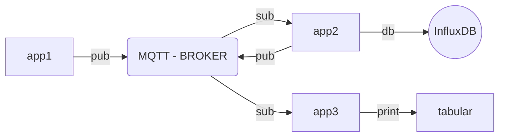

## Demo App


# Docker Build
```
docker-compose --env-file your-env build --no-cache
```

### Docker-Compose Run

```
docker-compose --env-file your-env up
```

```
docker-compose --env-file your-env up -d # for Detached mode
```

### Docker-Compose Stop
```
docker-compose stop
```

### Docker-Compose Destroy

```
docker-compose --env-file your-env down
```

### Docker-Compose process

```
docker-compose ps

docker ps

docker ps -a
```

## Docker Utils

```
docker logs -f DOCKER-CONTAINER-NAME

docker exec -ti DOCKER-CONTAINER-NAME bash

docker stop DOCKER-CONTAINER-NAME

docker start DOCKER-CONTAINER-NAME

docker status DOCKER-CONTAINER-NAME

docker commit -m "MESSAGE" DOCKER-CONTAINER-NAME DOCKER-REPO-NAME:TAG
```

## Terraform 


### AWS
- Create a local SSH key or Upload Your Publish Key
- Download AWS ACCESS KEY and SECRET KEY
```
export AWS_ACCESS_KEY_ID="anaccesskey"
export AWS_SECRET_ACCESS_KEY="asecretkey"
export AWS_DEFAULT_REGION="asecretkey"
```
- edit region, type and key_name for ssh key pair
```
vi terraform.tfvars

aws_region      = "us-east-1"
key_name        = "XXXXXXXX"
instance_type   = "t2.micro"
```

- edit / check for instance and port [EIP/EC2/SG]
```
vi ec2.tf 
aws_security_group
aws_instance
aws_eip
aws_ami
```


### Packer

- edit or check for build provisioner
```
vi vm.pkr.hcl

  provisioner "file" {
    destination = "/tmp/"
    source      = "./mqtt.ter.tgz"
  }
```

- Build AMI
```
packer build vm.pkr.hcl
```

additional 

```
packer init .
packer vailadate .
```

### Terraform 


-  Plan for Terraform
```
terraform plan
```

- Provision Infra
```
terraform apply --auto-approve
```
- Login EC2 with pem key (Optional)
```
ssh -i KEY_NAME.pem ubuntu@PACKER_EIP
```

### Clean up Infra
```
terraform destroy --auto-approve
```
### GitHub Actions
- Setting - Secret - Actions
```
AWS_ACCESS_KEY_ID
AWS_DEFAULT_REGION
AWS_SECRET_ACCESS_KEY
TF_API_TOKEN
ENV_FILE
```

## Services

### MQTT Expolorer
```
PACKER_EIP:4000
```
### InfluxDB
```
PACKER_EIP:8086
```

